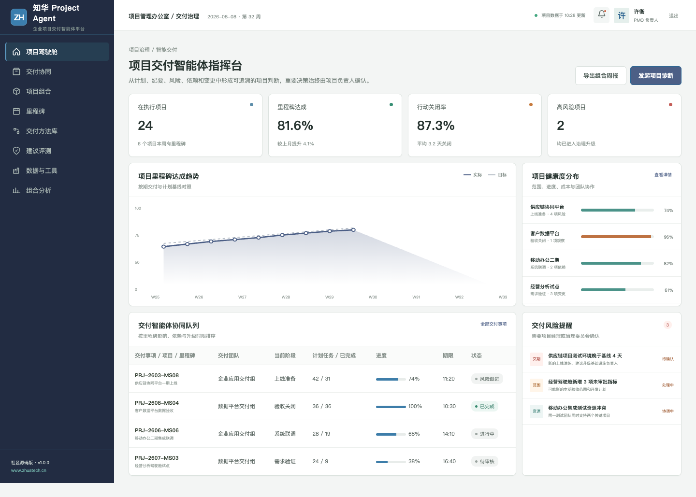
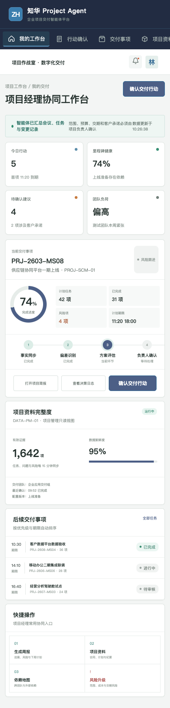

# ProjectAgent · 知华科技项目交付智能体

> 从计划、会议和变更记录中，形成可追溯的项目行动。
>
> [知华科技（上海如静知华信息科技有限公司）官网](https://www.zhuatech.cn/) · 企业 AI 转型、Agent 定制、私有化部署与软件项目外包

服务项目经理、交付团队与 PMO 的 AI Agent 社区源码项目。它汇总项目事实、识别里程碑偏差、梳理依赖、形成周报与行动建议，同时保护项目基线、预算和客户承诺。

## 项目运行模型

| 输入证据 | Agent 辅助 | 人工责任 |
| --- | --- | --- |
| 计划、任务、纪要、风险、变更 | 事实同步、偏差识别、行动建议 | 确认范围、优先级与责任人 |
| 成本、资源和依赖 | 风险评分、情景分析、升级提示 | 调整资源与项目基线 |
| 客户会议与验收记录 | 周报草稿、承诺检查、材料清单 | 客户沟通、承诺与验收决策 |

## 产品界面

项目交付智能体指挥台提供跨团队任务、风险、建议评测和数据工具的运营视角。

项目经理协同工作台面向一线业务角色，保留证据、建议、人工确认和结果回写的完整链路。

## 主要能力

- 项目计划、任务与纪要事实汇总
- 里程碑延期与资源冲突提示
- 范围漂移和未审批变更识别
- 项目周报与治理材料草稿
- 跨团队依赖责任链梳理
- 预算、基线和客户承诺人工审批

## 工程实现

| 层次 | 技术与职责 |
| --- | --- |
| H5 / Web | Vue 3、Pinia、Vue Router、Axios、Vite，响应式适配桌面与移动端 |
| Java API | Java 21、Spring Boot、Spring Security、JWT、JPA、Bean Validation |
| Agent 边界 | AgentRuntime 可替换，默认只运行本地演示，不调用真实模型或业务系统 |
| 领域策略 | DeliveryRiskService 提供可测试、可解释的业务安全规则 |
| 数据 | MySQL 8、Flyway；测试环境使用 H2 |
| 交付 | Docker Compose、Nginx、CI、API、架构、数据库和部署文档 |

使用进度偏差、成本偏差、关键依赖和客户承诺影响计算风险等级，明确建议动作与治理升级条件。

## 本地体验

仅查看演示界面：

~~~bash
cd frontend
npm install
npm run dev:demo
~~~

访问 http://localhost:5173。管理端使用 **planner / Demo@2026**，业务协同端使用 **operator / Demo@2026**。

完整部署参数见 [deploy/README.md](deploy/README.md)，接口见 [docs/api.md](docs/api.md)，架构边界见 [docs/architecture.md](docs/architecture.md)。

## 使用许可与商业授权

本工程采用知华科技社区源码许可，**仅限个人学习、研究和非商业技术交流，不得商用**。企业内部使用、生产部署、项目交付、SaaS、收费服务、二次销售、品牌替换或其他商业用途，必须事先取得上海如静知华信息科技有限公司书面授权。完整条款以 [LICENSE](LICENSE) 为准。

深度定制、私有化部署、商业授权、AI Agent 咨询和软件项目外包，可访问[知华科技官网](https://www.zhuatech.cn/)或扫码咨询。

| 商务与技术咨询 | 项目合作咨询 |
| --- | --- |
|  |  |

SEO 关键词：Project Agent,项目管理智能体,PMO AI,项目风险预测,项目周报 Agent,Java Vue 项目管理，知华科技，上海如静知华信息科技有限公司。

## 企业级项目 Agent 行动执行

新增 `POST /api/enterprise/projectagent/project-action-execution`，覆盖基线、权限、预算、进度、风险、依赖、外部承诺、回滚和审计，返回 `EXECUTE / COORDINATE / BLOCKED`。详见 [行动执行说明](docs/ENTERPRISE_PROJECT_ACTION.md)。
